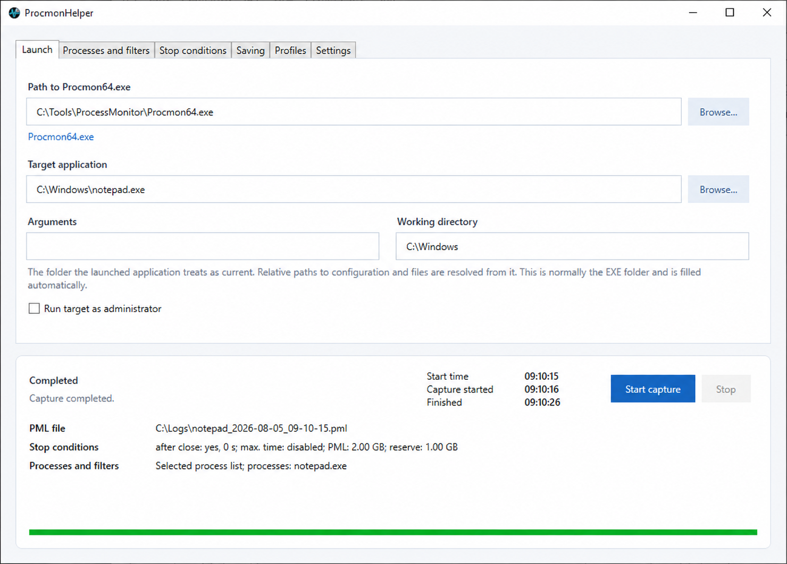

# ProcmonHelper

English · [Русский](README_RU.md)

Process Monitor records activity from the entire system. Starting a capture too early or stopping it too late fills the PML with unrelated events and makes the useful information harder to find.

ProcmonHelper starts capture immediately before launching the selected application and stops it at the required moment. This produces a smaller, cleaner, and more focused log containing the application startup and the activity needed for diagnosis.

## Why use it

- Capture begins immediately before the target application starts: early startup events are preserved without collecting unrelated activity beforehand.
- Capture stops at the required moment instead of continuing to fill the log with unnecessary events.
- Collection can stop automatically when the target closes, after a time limit, at a PML size limit, or when the free-space reserve is reached.
- Manual stop finalizes and preserves the collected PML.
- The PML is saved locally first, so a failed CSV/XML export or network copy does not discard the main trace.
- Reusable profiles keep launch, capture, stop, and save settings together.
- The status panel shows capture timing, active conditions, filters, and the saved file path.
- No installation is required: the release is a single portable EXE.

## Requirements

- Windows 10 or Windows 11 x64
- `Procmon64.exe` from the official [Microsoft Sysinternals Process Monitor page](https://learn.microsoft.com/sysinternals/downloads/procmon)
- Administrator approval when the capture worker starts

Process Monitor is not included and is never downloaded automatically. If its license dialog has not been accepted yet, start `Procmon64.exe` manually once before using ProcmonHelper.

## Quick start

1. Download and extract Process Monitor.
2. Start `ProcmonHelper.exe` and select `Procmon64.exe`.
3. Select the application whose launch you want to trace. Arguments and working directory are optional.
4. Configure capture mode and stop conditions.
5. Select the local folder where the PML should be saved.
6. Click **Start capture** and approve elevation.
7. Use the launched application normally. Stop it manually when needed, or let the configured condition stop the capture.

The completed PML path is shown in the status panel. PML files can be opened directly in Process Monitor.

## Capture modes and filters

- **All events** starts Process Monitor without inherited saved filters.
- **Selected processes** stores the process list in the profile and capture summary. It does not physically remove unrelated events from the raw PML.
- **PMC configuration** loads a user-prepared `.PMC` file. Use this mode when the PML itself must be filtered by Process Monitor rules.

ProcmonHelper is not added to the selected process list. In **All events** mode it can still appear in the raw PML; use an Exclude rule in a PMC file when physical exclusion is required.

## License

ProcmonHelper is distributed under the [MIT License](LICENSE).

## Download

